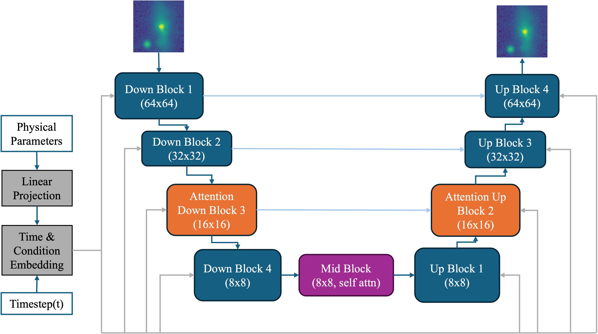

# Gal-n-AGN Image Emulator

Training and inference scripts for a diffusion model trained on synthetic forward modelled galaxy and AGN images.

# Installation

You should install the environment using conda.
Esure that you edit the environement file for the version on CUDA you have installed.

```bash
conda env create -f environment.yml
```

Ensure the device has access to CUDA when installing pytorch and diffusers.

# Architecture

Built Using Diffusers Conditional 2d Unet (https://huggingface.co/docs/diffusers/api/models/unet2d-cond)



# Training

This model is built to train on synthetic forward modelled galxay cutouts made with [MOCS](https://github.com/RhysAlfShaw/MOCS).


# Inference

Inference can be done using the provided ```train.py``` script.


